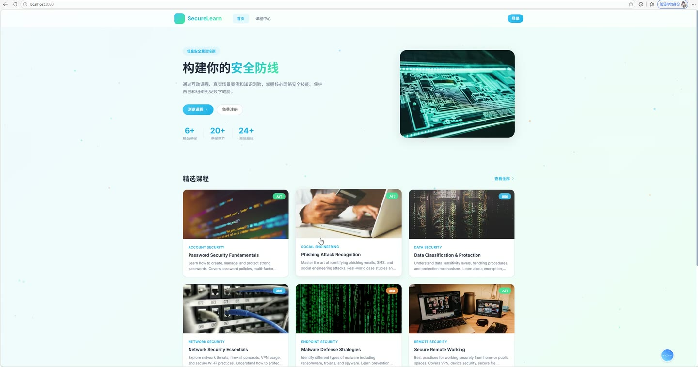
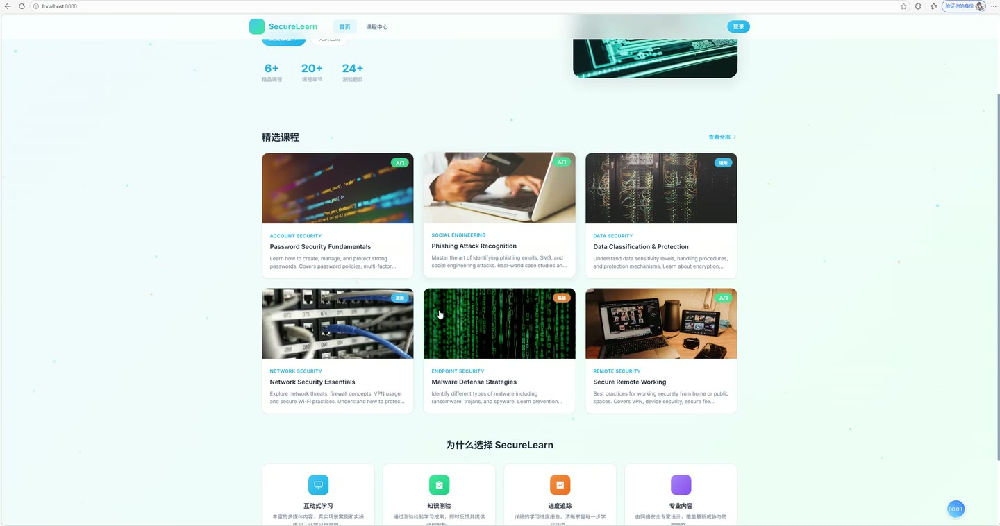
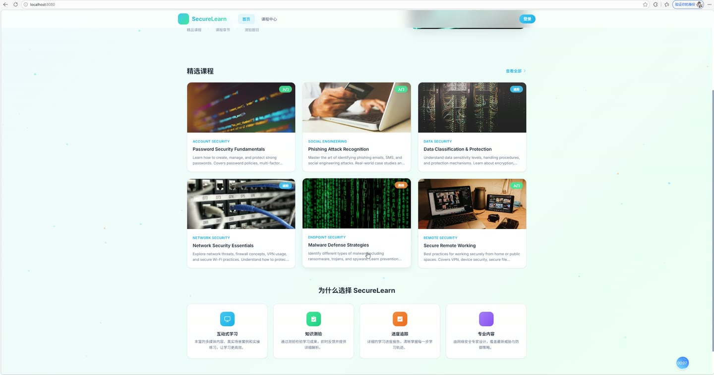
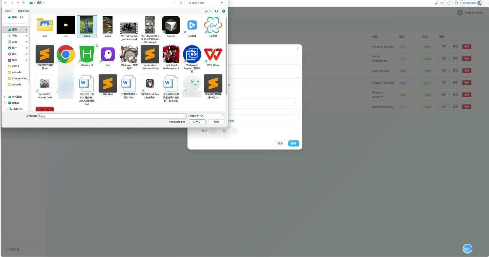
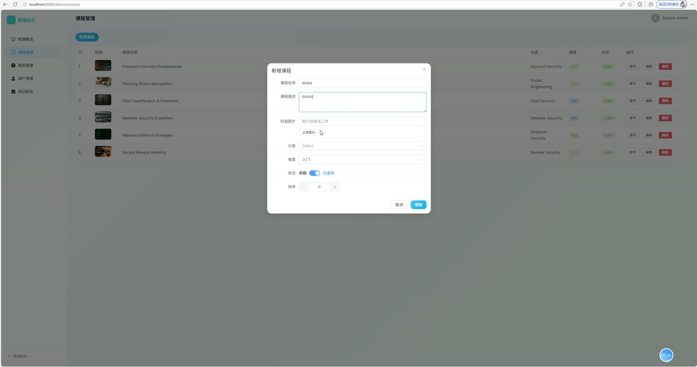
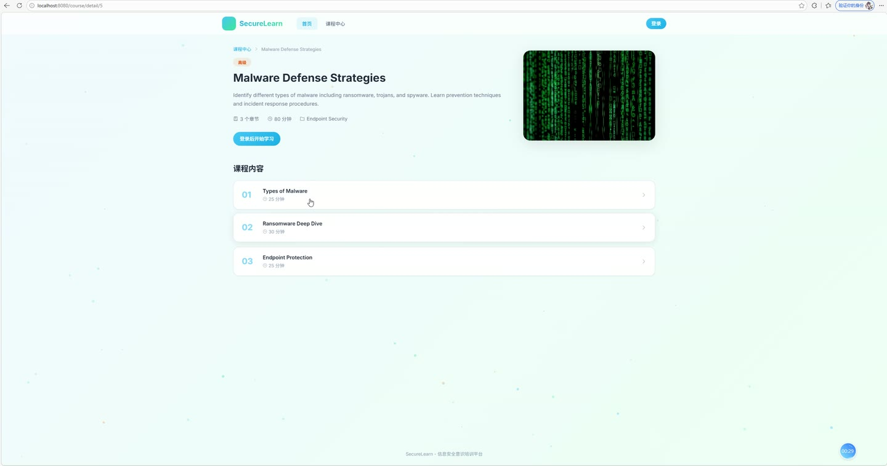

# (附文档)Springboot3+Vue3+MySQL 信息安全意识培训系统

**技术栈**：Springboot3、Vue3、MySQL

### 系统简介

信息安全意识培训系统是一套基于前后端分离架构的在线培训管理平台，采用 Spring Boot 3 + Vue 3 + MySQL 技术栈构建。系统内置普通用户端与管理员端两大角色，提供课程学习、章节管理、在线测验、学习进度追踪、用户管理、数据统计等完整功能链路，适用于企业或机构开展信息安全意识培训与考核。
 
### 核心功能
 
### 普通用户端

 
- 用户注册与登录：支持通过用户名、密码、真实姓名、邮箱完成注册，登录后签发 JWT Token，并自动校验账号启用状态（禁用账号拒绝登录）。 
- 课程浏览与检索：在课程中心按关键词搜索课程名称、按分类（账号安全、社会工程、数据安全、网络安全、终端安全、远程安全）筛选课程，分页展示已发布课程。 
- 课程详情查看：展示课程封面、简介、难度等级（入门/进阶/高级）、分类、章节数量与总时长，未登录用户可浏览，登录用户可直接进入学习。 
- 在线章节学习：左侧章节导航栏支持切换章节，章节内可播放视频（videoUrl）、阅读富文本内容，支持上一章/下一章跳转。 
- 学习进度上报：学习过程中可上报当前章节学习百分比，系统自动记录最大进度，达到 100% 自动标记该章节为已完成。 
- 我的课程列表：展示已产生学习记录的课程，显示每门课程的平均学习进度、总章节数与已完成章节数。 
- 在线测验作答：进入课程测验后，系统返回不含正确答案的题目列表（题干 + A/B/C/D 选项），支持提交作答答案与作答耗时。 
- 测验结果即时反馈：提交后立即返回得分（百分制）、答对题数、总题数，并逐题展示用户答案、正确答案、是否正确及题目解析。 
- 历史测验记录：查看个人全部测验记录，包含分数、答对/总题数、耗时与提交时间。 
- 学习仪表盘：展示已报名课程数、已完成章节数、学习章节总数、最近 5 条测验成绩记录。 
- 个人资料维护：查看与修改真实姓名、邮箱、手机号、头像信息。
 
### 管理员端

 
- 数据统计看板：展示平台课程总数、学员总数、题库题目总数。 
- 课程管理：查看全部课程列表，支持新增课程（填写标题、描述、封面图、分类、难度、状态、排序）、编辑课程信息、删除课程。 
- 章节管理：按课程查看章节目录，支持新增章节（填写所属课程、标题、富文本内容、视频链接、时长、排序）、编辑章节、删除章节。 
- 题库管理：查看全部测验题目列表，支持按课程筛选题目，新增题目（填写所属课程/章节、题干、题型、A-D 选项、正确答案、解析、排序）、编辑题目、删除题目。 
- 用户管理：分页查看用户列表，支持按用户名/真实姓名模糊搜索，编辑用户资料（含重置密码），启用/禁用用户账号，删除用户。 
- 测验成绩报表：按课程查看该课程下所有学员的测验记录，包含分数、答对题数、总题数、耗时与提交时间。 
- 文件上传：支持上传图片/视频等教学资源文件，上传后自动生成访问 URL 并用于课程封面、章节视频等场景。
 
### 技术栈

  后端框架 Spring Boot 3.x   ORM 框架 MyBatis-Plus（含分页插件、逻辑删除）   权限认证 Spring Security + JWT（BCrypt 密码加密，角色区分 ADMIN/STUDENT）   前端框架 Vue 3（Composition API +  语法）   状态管理 Pinia（用户登录态管理）   路由 Vue Router 4（History 模式，含路由守卫）   UI 组件库 Element Plus   构建工具 Vite   数据库 MySQL 8.x（数据库名 sec_training）   数据表 user、course、chapter、quiz_question、quiz_record、quiz_answer、study_progress 
 
### 交付内容

 
- 后端完整源码 
- 前端完整源码 
- 数据库初始化脚本 
- 万字文档

## 界面展示

---

## 获取完整源码 + 万字文档

本仓库为项目介绍页。**完整前后端源码、数据库初始化脚本、万字项目文档**，请加微信 `kangkangcode`，或访问 [codekk.top](http://codekk.top) 获取。

可作课程设计 / 毕业设计参考，支持远程部署调试。